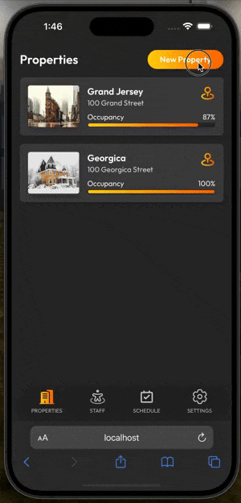

# Bottom Sheet
A responsive bottom sheet for react applications. This bottom sheet will morph into a more standard modal appearance when the screen size is above that of a typical mobile device



## Installation
```bash
npm i @figliolia/bottom-sheet
# or
yarn add @figliolia/bottom-sheet
```

## Basic Usage
To create a bottom sheet, wrap your content in `<BottomSheet/>` tags and specify your options:
```tsx
import { BottomSheet } from "@figliolia/bottom-sheet";

export const BottomSheetForm = ({ open, closeFN }) => {
  return (
    <BottomSheet 
      dim 
      notch 
      open={open}
      close={closeFN}
      className="my-bottom-sheet">
      <form>
        <input />
        <input />
        <input />
        <input type="submit">Submit</button>
      </form>
    </BottomSheet>
  );
}
```
You've now created a bottom sheet that'll morph into a modal on larger devices!

## Browser Support
This package relies on CSS variables and nesting in order to function. For more detailed information on specific browser version support, please reference the [CSS Variables](https://caniuse.com/css-variables) and [CSS Nesting](https://caniuse.com/?search=css%20nesting) support tables.

## Troubleshooting Vite Builds
In Vite's [issues](https://github.com/vitejs/vite/issues) tab you'll find open and closed complaints of build errors reporting that a dependency's export cannot be found. After investigating this issue, it seems Vite can miss an export or two during its compilation/optimization of a module.

If you run into this issue while using this library, add the following to your vite.config.ts:
```typescript
export default defineConfig({
  // ...your config

  // Add this 
  optimizeDeps: {
    exclude: ["@figliolia/bottom-sheet"]
  },
});
```

The build error will subside.